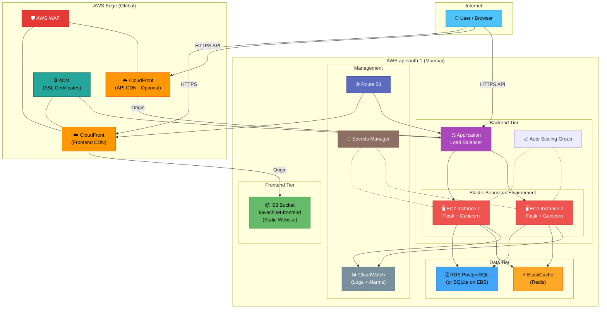
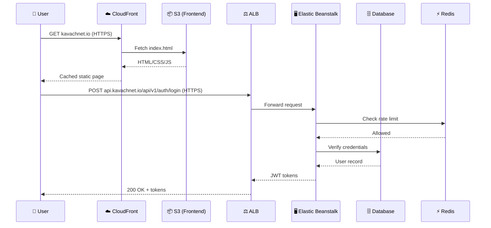

# KavachNet v2 — Production-Grade AWS Deployment Architecture ☁️🛡️

> **Author**: Senior Cloud Architect & DevOps Engineer  
> **Stack**: Python/Flask Backend · Static HTML/CSS/Bootstrap Frontend  
> **Region**: `ap-south-1` (Mumbai)  
> **Last Updated**: March 2026

---

## Table of Contents

1. [Full AWS Architecture](#1-full-aws-architecture)
2. [Architecture Diagram](#2-architecture-diagram)
3. [Frontend Deployment (S3 + CloudFront)](#3-frontend-deployment)
4. [Backend Deployment (Elastic Beanstalk)](#4-backend-deployment)
5. [Security Configuration](#5-security-configuration)
6. [Scalability](#6-scalability)
7. [CI/CD Pipeline (GitHub Actions)](#7-cicd-pipeline)
8. [Monitoring & Logs](#8-monitoring--logs)
9. [Production Best Practices](#9-production-best-practices)
10. [Testing](#10-testing)

---

## 1. Full AWS Architecture

### Overview

```
User → CloudFront (CDN + HTTPS) → S3 (Frontend Static Assets)
                ↓ (API calls)
User → CloudFront → ALB (HTTPS) → Elastic Beanstalk (Flask + Gunicorn)
                                            ↓
                                     SQLite / RDS / Redis
```

### Component Breakdown

| Component                 | AWS Service                                | Purpose                                               |
| ------------------------- | ------------------------------------------ | ----------------------------------------------------- |
| **Frontend Hosting**      | S3 + CloudFront                            | Serve HTML, CSS, JS, images globally with low latency |
| **CDN & HTTPS**           | CloudFront                                 | Edge caching, SSL termination, DDoS protection        |
| **SSL Certificates**      | ACM (AWS Certificate Manager)              | Free, auto-renewing TLS certificates                  |
| **Backend Hosting**       | Elastic Beanstalk (Docker)                 | Managed Flask/Gunicorn deployment                     |
| **Load Balancer**         | ALB (Application Load Balancer)            | Distributes traffic across backend instances          |
| **DNS**                   | Route 53                                   | Domain → CloudFront/ALB resolution                    |
| **Database**              | SQLite on EBS _or_ Amazon RDS (PostgreSQL) | Persistent data storage                               |
| **Caching/Rate Limiting** | ElastiCache (Redis)                        | Session state, rate limiting (replaces local Redis)   |
| **Secrets**               | AWS Secrets Manager / SSM Parameter Store  | Store API keys, DB passwords, SMTP creds              |
| **WAF**                   | AWS WAF                                    | Layer-7 firewall on CloudFront                        |
| **Monitoring**            | CloudWatch                                 | Logs, metrics, alarms                                 |

### DNS Layout (Route 53)

| Record             | Type      | Target                             |
| ------------------ | --------- | ---------------------------------- |
| `kavachnet.io`     | A (Alias) | CloudFront Distribution (frontend) |
| `www.kavachnet.io` | CNAME     | `kavachnet.io`                     |
| `api.kavachnet.io` | A (Alias) | Elastic Beanstalk ALB (backend)    |

---

## 2. Architecture Diagram



### Data Flow Summary



---

## 3. Frontend Deployment

### Step 1: Create S3 Bucket

```bash
# Create the bucket in ap-south-1
aws s3 mb s3://kavachnet-frontend --region ap-south-1

# Enable static website hosting
aws s3 website s3://kavachnet-frontend \
  --index-document landing.html \
  --error-document landing.html
```

### Step 2: Configure Bucket Policy (Public Read)

Create a file `bucket-policy.json`:

```json
{
  "Version": "2012-10-17",
  "Statement": [
    {
      "Sid": "PublicReadGetObject",
      "Effect": "Allow",
      "Principal": "*",
      "Action": "s3:GetObject",
      "Resource": "arn:aws:s3:::kavachnet-frontend/*"
    }
  ]
}
```

Apply it:

```bash
aws s3api put-bucket-policy \
  --bucket kavachnet-frontend \
  --policy file://bucket-policy.json
```

> **Note**: If using CloudFront with Origin Access Control (OAC), you should **not** make the bucket public. Instead, use an OAC policy (see Step 4).

### Step 3: Configure `api.js` for Production

Before uploading, update the backend URL. You have two approaches:

**Option A — Inject `window.BACKEND_URL` in each HTML file** (already supported by `api.js`):

```html
<!-- Add this BEFORE the <script src="api.js"></script> tag in every HTML file -->
<script>
  window.BACKEND_URL = "https://api.kavachnet.io";
</script>
```

**Option B — Edit the fallback in `api.js`** (line 12):

```javascript
// Update this line to your actual API domain:
return "https://api.kavachnet.io/api/v1";
```

### Step 4: Upload Frontend to S3

```bash
# Sync the entire Frontend directory
aws s3 sync ./Frontend/ s3://kavachnet-frontend/ \
  --delete \
  --cache-control "public, max-age=86400" \
  --region ap-south-1

# Set shorter cache for HTML files (so updates propagate quickly)
aws s3 cp s3://kavachnet-frontend/ s3://kavachnet-frontend/ \
  --recursive \
  --exclude "*" \
  --include "*.html" \
  --cache-control "public, max-age=300" \
  --metadata-directive REPLACE
```

### Step 5: Create CloudFront Distribution

**Via AWS Console:**

1. Go to **CloudFront** → Create Distribution
2. **Origin Domain**: `kavachnet-frontend.s3.ap-south-1.amazonaws.com`
3. **Origin Access**: Origin Access Control (OAC) — create a new OAC
4. **Viewer Protocol Policy**: Redirect HTTP to HTTPS
5. **Allowed HTTP Methods**: GET, HEAD
6. **Cache Policy**: `CachingOptimized`
7. **Alternate Domain Name (CNAME)**: `kavachnet.io`, `www.kavachnet.io`
8. **SSL Certificate**: Select ACM certificate (see [Section 5](#5-security-configuration))
9. **Default Root Object**: `landing.html`
10. **Price Class**: Use Only North America, Europe, Asia (cost savings)

**Via AWS CLI:**

```bash
aws cloudfront create-distribution \
  --origin-domain-name kavachnet-frontend.s3.ap-south-1.amazonaws.com \
  --default-root-object landing.html \
  --region ap-south-1
```

**OAC Bucket Policy** (replaces the public bucket policy from Step 2):

```json
{
  "Version": "2012-10-17",
  "Statement": [
    {
      "Sid": "AllowCloudFrontServicePrincipal",
      "Effect": "Allow",
      "Principal": {
        "Service": "cloudfront.amazonaws.com"
      },
      "Action": "s3:GetObject",
      "Resource": "arn:aws:s3:::kavachnet-frontend/*",
      "Condition": {
        "StringEquals": {
          "AWS:SourceArn": "arn:aws:cloudfront::YOUR_ACCOUNT_ID:distribution/YOUR_DIST_ID"
        }
      }
    }
  ]
}
```

### Step 6: Invalidate Cache After Deployment

```bash
aws cloudfront create-invalidation \
  --distribution-id YOUR_DIST_ID \
  --paths "/*"
```

---

## 4. Backend Deployment

### Architecture Decision

Your backend currently uses a **Docker container** with gunicorn. Elastic Beanstalk with the **Docker platform** is ideal — it uses your existing `Dockerfile` directly.

> **Important Note on SQLite**: SQLite stores data on the local filesystem. On Elastic Beanstalk, instance storage is **ephemeral**. For production:
>
> - **Option A**: Attach an EBS volume and point SQLite at the mounted path (single-instance only)
> - **Option B** (Recommended): Migrate to **Amazon RDS PostgreSQL** for durability and scalability

### Step 1: Prepare the Project

Ensure your `Backend/` directory has:

```
Backend/
├── Dockerfile          ✅ Already exists
├── Procfile            ✅ Already exists
├── requirements.txt    ✅ Already exists
├── app.py              ✅ Already exists
├── config.py           ✅ Already exists
├── .ebextensions/      ← CREATE THIS (see below)
│   └── 01_options.config
├── routes/
├── models/
├── services/
└── utils/
```

### Step 2: Create `.ebextensions` Configuration

Create `Backend/.ebextensions/01_options.config`:

```yaml
option_settings:
  aws:elasticbeanstalk:application:environment:
    NODE_ENV: production
    PORT: 5000
    ALLOWED_ORIGINS: "https://kavachnet.io,https://www.kavachnet.io"

  # Health check configuration
  aws:elasticbeanstalk:environment:process:default:
    HealthCheckPath: /health
    MatcherHTTPCode: "200"

  # Proxy settings
  aws:elasticbeanstalk:environment:proxy:
    ProxyServer: none

  # Instance settings
  aws:autoscaling:launchconfiguration:
    InstanceType: t3.small
    IamInstanceProfile: aws-elasticbeanstalk-ec2-role

  # Auto-scaling
  aws:autoscaling:asg:
    MinSize: 2
    MaxSize: 4

  # Load balancer
  aws:elasticbeanstalk:environment:
    LoadBalancerType: application

  aws:elbv2:listener:443:
    ListenerEnabled: true
    Protocol: HTTPS
    SSLCertificateArns: arn:aws:acm:ap-south-1:YOUR_ACCOUNT:certificate/YOUR_CERT_ID
```

### Step 3: Create Deployment Bundle

```bash
# Navigate to Backend directory
cd Backend

# Create the deployment zip (exclude unnecessary files)
zip -r ../kavachnet-backend.zip . \
  -x ".env" \
  -x "*.pyc" \
  -x "__pycache__/*" \
  -x ".git/*" \
  -x "kavachnet.db" \
  -x "logs/*" \
  -x "test_*.py" \
  -x ".venv/*"
```

On Windows (PowerShell):

```powershell
# Navigate to Backend directory
cd Backend

# Create deployment zip
Compress-Archive -Path * `
  -DestinationPath ..\kavachnet-backend.zip `
  -Force

# Note: Manually remove test files and .env from the zip, or use 7-Zip:
# 7z a -tzip ..\kavachnet-backend.zip . -x!.env -x!*.pyc -x!__pycache__ -x!kavachnet.db -x!logs -x!test_*.py
```

### Step 4: Install EB CLI

```bash
pip install awsebcli

# Configure AWS credentials
aws configure
# AWS Access Key ID: [your key]
# AWS Secret Access Key: [your secret]
# Default region: ap-south-1
# Output format: json
```

### Step 5: Initialize Elastic Beanstalk

```bash
cd Backend

# Initialize EB application
eb init kavachnet-backend \
  --platform "Docker" \
  --region ap-south-1 \
  --keyname your-ec2-keypair

# Create the environment
eb create kavachnet-prod \
  --instance_type t3.small \
  --elb-type application \
  --min-instances 2 \
  --max-instances 4 \
  --region ap-south-1 \
  --tags "Project=KavachNet,Environment=Production"
```

### Step 6: Set Environment Variables

```bash
eb setenv \
  NODE_ENV=production \
  SECRET_KEY="$(openssl rand -hex 32)" \
  JWT_SECRET_KEY="$(openssl rand -hex 32)" \
  SUPERADMIN_USERNAME=kavachnet_root \
  SUPERADMIN_PASSWORD="$(openssl rand -base64 24)" \
  ALLOWED_ORIGINS="https://kavachnet.io,https://www.kavachnet.io" \
  EMAIL_PROVIDER=smtp \
  EMAIL_ADDRESS=noreply@kavachnet.io \
  EMAIL_PASSWORD=your-app-specific-password \
  SMTP_SERVER=smtp.gmail.com \
  SMTP_PORT=587 \
  EMAIL_DRY_RUN=False \
  REDIS_URL=redis://your-elasticache-endpoint:6379/0
```

### Step 7: Deploy

```bash
# Deploy the latest code
eb deploy kavachnet-prod

# Open in browser to verify
eb open

# Check health
eb health
```

### Verify the Backend

```bash
# Via curl
curl https://api.kavachnet.io/health

# Expected response:
# {
#   "status": "success",
#   "message": "KavachNet Operational",
#   "data": {
#     "version": "v4.0.0-production",
#     "redis": "Connected",
#     "email_queue_worker": "Active"
#   }
# }
```

---

## 5. Security Configuration

### 5.1 HTTPS with ACM

```bash
# Request a certificate (must be in us-east-1 for CloudFront, ap-south-1 for ALB)
# For CloudFront:
aws acm request-certificate \
  --domain-name kavachnet.io \
  --subject-alternative-names "*.kavachnet.io" \
  --validation-method DNS \
  --region us-east-1

# For ALB (Elastic Beanstalk):
aws acm request-certificate \
  --domain-name api.kavachnet.io \
  --validation-method DNS \
  --region ap-south-1
```

**DNS Validation**: Add the CNAME records provided by ACM to your Route 53 hosted zone. Certificates auto-validate in ~5 minutes.

### 5.2 Secure Headers (Already Implemented)

Your `app.py` already applies excellent security headers in `apply_security_headers()`:

```python
# Already in your app.py — no changes needed!
X-Content-Type-Options: nosniff
X-Frame-Options: DENY
X-XSS-Protection: 1; mode=block
Referrer-Policy: strict-origin-when-cross-origin
Strict-Transport-Security: max-age=31536000; includeSubDomains; preload
Content-Security-Policy: default-src 'self'; ...
```

**Production Enhancement**: Update the CSP `connect-src` to include your actual API domain:

```python
# In config.py, set ALLOWED_ORIGINS for production:
ALLOWED_ORIGINS=https://kavachnet.io,https://www.kavachnet.io,https://api.kavachnet.io
```

### 5.3 CORS Configuration

Your `app.py` already has CORS configured. For production, set the env var:

```bash
ALLOWED_ORIGINS=https://kavachnet.io,https://www.kavachnet.io
```

This ensures the Flask-CORS middleware only allows requests from your frontend domains.

### 5.4 IAM Roles

Create minimal-privilege IAM roles:

**Elastic Beanstalk Service Role** (`aws-elasticbeanstalk-service-role`):

```json
{
  "Version": "2012-10-17",
  "Statement": [
    {
      "Effect": "Allow",
      "Action": [
        "elasticloadbalancing:*",
        "autoscaling:*",
        "cloudwatch:*",
        "s3:GetObject",
        "ec2:Describe*",
        "ec2:RunInstances",
        "ec2:TerminateInstances",
        "logs:*"
      ],
      "Resource": "*"
    }
  ]
}
```

**EC2 Instance Profile** (`kavachnet-ec2-role`):

```json
{
  "Version": "2012-10-17",
  "Statement": [
    {
      "Effect": "Allow",
      "Action": [
        "secretsmanager:GetSecretValue",
        "ssm:GetParameter",
        "logs:CreateLogGroup",
        "logs:CreateLogStream",
        "logs:PutLogEvents",
        "cloudwatch:PutMetricData",
        "s3:GetObject"
      ],
      "Resource": [
        "arn:aws:secretsmanager:ap-south-1:*:secret:kavachnet/*",
        "arn:aws:ssm:ap-south-1:*:parameter/kavachnet/*",
        "arn:aws:logs:ap-south-1:*:*",
        "arn:aws:s3:::kavachnet-*"
      ]
    }
  ]
}
```

### 5.5 Environment Variables & Secrets

**Option A — Elastic Beanstalk Environment Variables** (simplest):

```bash
eb setenv SECRET_KEY=xxx JWT_SECRET_KEY=yyy ...
```

**Option B — AWS Secrets Manager** (recommended for sensitive values):

```bash
# Store secrets
aws secretsmanager create-secret \
  --name kavachnet/production/app-secrets \
  --secret-string '{
    "SECRET_KEY": "your-production-secret",
    "JWT_SECRET_KEY": "your-jwt-secret",
    "SUPERADMIN_PASSWORD": "your-superadmin-pass",
    "EMAIL_PASSWORD": "your-smtp-password"
  }' \
  --region ap-south-1
```

Then fetch in your `config.py` at startup:

```python
# Add this to config.py for production secret retrieval
import json, boto3

def get_aws_secrets():
    """Fetch secrets from AWS Secrets Manager in production."""
    if os.getenv("NODE_ENV") != "production":
        return {}
    try:
        client = boto3.client("secretsmanager", region_name="ap-south-1")
        response = client.get_secret_value(SecretId="kavachnet/production/app-secrets")
        return json.loads(response["SecretString"])
    except Exception as e:
        print(f"[WARN] Could not fetch AWS secrets: {e}")
        return {}
```

### 5.6 AWS WAF (Web Application Firewall)

Attach WAF to CloudFront for Layer-7 protection:

```bash
# Create a WAF Web ACL with AWS Managed Rules
aws wafv2 create-web-acl \
  --name kavachnet-waf \
  --scope CLOUDFRONT \
  --default-action Allow={} \
  --rules '[
    {
      "Name": "AWSManagedRulesCommonRuleSet",
      "Priority": 1,
      "Statement": {
        "ManagedRuleGroupStatement": {
          "VendorName": "AWS",
          "Name": "AWSManagedRulesCommonRuleSet"
        }
      },
      "OverrideAction": {"None": {}},
      "VisibilityConfig": {
        "SampledRequestsEnabled": true,
        "CloudWatchMetricsEnabled": true,
        "MetricName": "CommonRuleSet"
      }
    },
    {
      "Name": "AWSManagedRulesKnownBadInputsRuleSet",
      "Priority": 2,
      "Statement": {
        "ManagedRuleGroupStatement": {
          "VendorName": "AWS",
          "Name": "AWSManagedRulesKnownBadInputsRuleSet"
        }
      },
      "OverrideAction": {"None": {}},
      "VisibilityConfig": {
        "SampledRequestsEnabled": true,
        "CloudWatchMetricsEnabled": true,
        "MetricName": "BadInputs"
      }
    }
  ]' \
  --visibility-config SampledRequestsEnabled=true,CloudWatchMetricsEnabled=true,MetricName=kavachnet-waf \
  --region us-east-1
```

---

## 6. Scalability

### 6.1 Auto Scaling in Elastic Beanstalk

Create `Backend/.ebextensions/02_scaling.config`:

```yaml
option_settings:
  # Scaling triggers based on CPU
  aws:autoscaling:trigger:
    MeasureName: CPUUtilization
    Statistic: Average
    Unit: Percent
    UpperThreshold: 70
    UpperBreachScaleIncrement: 1
    LowerThreshold: 30
    LowerBreachScaleIncrement: -1
    BreachDuration: 5
    Period: 5

  # Instance limits
  aws:autoscaling:asg:
    MinSize: 2
    MaxSize: 6
    Cooldown: 300

  # Rolling updates (zero-downtime deployment)
  aws:autoscaling:updatepolicy:rollingupdate:
    RollingUpdateEnabled: true
    RollingUpdateType: Health
    MinInstancesInService: 1
    MaxBatchSize: 1

  # Enhanced health reporting
  aws:elasticbeanstalk:healthreporting:system:
    SystemType: enhanced
```

### 6.2 Load Balancing

The Application Load Balancer (ALB) is automatically created by Elastic Beanstalk. Customize it:

```yaml
# In .ebextensions/01_options.config
option_settings:
  # Sticky sessions (for session-based auth)
  aws:elasticbeanstalk:environment:process:default:
    StickinessEnabled: false
    HealthCheckPath: /health
    HealthCheckInterval: 30
    HealthyThresholdCount: 3
    UnhealthyThresholdCount: 5

  # Connection draining
  aws:elb:policies:
    ConnectionDrainingEnabled: true
    ConnectionDrainingTimeout: 20
```

> **Why `StickinessEnabled: false`?** KavachNet uses JWT tokens (stateless auth), so requests can go to any instance. If you later add server-side sessions, enable sticky sessions.

### 6.3 CloudFront Caching Strategy

| Content Type  | Cache TTL    | Reason                  |
| ------------- | ------------ | ----------------------- |
| HTML files    | 5 minutes    | Frequent updates        |
| CSS/JS        | 24 hours     | Versioned, cache-busted |
| Images        | 30 days      | Rarely change           |
| API responses | 0 (no cache) | Dynamic data            |

**CloudFront Cache Behaviors:**

```
Behavior 1 (Default): *.html → TTL = 300s
Behavior 2: *.css, *.js → TTL = 86400s
Behavior 3: *.png, *.jpg → TTL = 2592000s
Behavior 4 (API): /api/* → Forward to ALB, TTL = 0
```

---

## 7. CI/CD Pipeline

### GitHub Actions Workflow

Create `.github/workflows/deploy.yml`:

```yaml
name: 🚀 Deploy KavachNet to AWS

on:
  push:
    branches: [main]
  workflow_dispatch:

env:
  AWS_REGION: ap-south-1
  EB_APP_NAME: kavachnet-backend
  EB_ENV_NAME: kavachnet-prod
  S3_FRONTEND_BUCKET: kavachnet-frontend
  CLOUDFRONT_DIST_ID: ${{ secrets.CLOUDFRONT_DIST_ID }}

jobs:
  # ═══════════════════════════════════════════
  # JOB 1: Deploy Frontend to S3 + CloudFront
  # ═══════════════════════════════════════════
  deploy-frontend:
    name: 🎨 Deploy Frontend
    runs-on: ubuntu-latest
    if: |
      contains(github.event.head_commit.message, '[frontend]') ||
      contains(github.event.head_commit.message, '[all]') ||
      github.event_name == 'workflow_dispatch'

    steps:
      - name: 📥 Checkout code
        uses: actions/checkout@v4

      - name: 🔧 Configure AWS Credentials
        uses: aws-actions/configure-aws-credentials@v4
        with:
          aws-access-key-id: ${{ secrets.AWS_ACCESS_KEY_ID }}
          aws-secret-access-key: ${{ secrets.AWS_SECRET_ACCESS_KEY }}
          aws-region: ${{ env.AWS_REGION }}

      - name: 📤 Sync Frontend to S3
        run: |
          aws s3 sync ./Frontend/ s3://${{ env.S3_FRONTEND_BUCKET }}/ \
            --delete \
            --cache-control "public, max-age=86400"

          # Set short TTL for HTML
          aws s3 cp s3://${{ env.S3_FRONTEND_BUCKET }}/ \
            s3://${{ env.S3_FRONTEND_BUCKET }}/ \
            --recursive \
            --exclude "*" --include "*.html" \
            --cache-control "public, max-age=300" \
            --metadata-directive REPLACE

      - name: 🔄 Invalidate CloudFront Cache
        run: |
          aws cloudfront create-invalidation \
            --distribution-id ${{ env.CLOUDFRONT_DIST_ID }} \
            --paths "/*"

  # ═══════════════════════════════════════════
  # JOB 2: Deploy Backend to Elastic Beanstalk
  # ═══════════════════════════════════════════
  deploy-backend:
    name: ⚙️ Deploy Backend
    runs-on: ubuntu-latest
    if: |
      contains(github.event.head_commit.message, '[backend]') ||
      contains(github.event.head_commit.message, '[all]') ||
      github.event_name == 'workflow_dispatch'

    steps:
      - name: 📥 Checkout code
        uses: actions/checkout@v4

      - name: 🔧 Configure AWS Credentials
        uses: aws-actions/configure-aws-credentials@v4
        with:
          aws-access-key-id: ${{ secrets.AWS_ACCESS_KEY_ID }}
          aws-secret-access-key: ${{ secrets.AWS_SECRET_ACCESS_KEY }}
          aws-region: ${{ env.AWS_REGION }}

      - name: 📦 Create Deployment Package
        run: |
          cd Backend
          zip -r ../kavachnet-backend-${{ github.sha }}.zip . \
            -x ".env" "*.pyc" "__pycache__/*" "kavachnet.db" \
               "logs/*" "test_*.py" ".venv/*" ".git/*"

      - name: 📤 Upload to S3
        run: |
          aws s3 cp kavachnet-backend-${{ github.sha }}.zip \
            s3://kavachnet-eb-deployments/kavachnet-backend-${{ github.sha }}.zip

      - name: 🏗️ Create EB Application Version
        run: |
          aws elasticbeanstalk create-application-version \
            --application-name ${{ env.EB_APP_NAME }} \
            --version-label "deploy-${{ github.sha }}" \
            --source-bundle S3Bucket=kavachnet-eb-deployments,S3Key=kavachnet-backend-${{ github.sha }}.zip \
            --region ${{ env.AWS_REGION }}

      - name: 🚀 Deploy to Elastic Beanstalk
        run: |
          aws elasticbeanstalk update-environment \
            --application-name ${{ env.EB_APP_NAME }} \
            --environment-name ${{ env.EB_ENV_NAME }} \
            --version-label "deploy-${{ github.sha }}" \
            --region ${{ env.AWS_REGION }}

      - name: ⏳ Wait for Deployment
        run: |
          aws elasticbeanstalk wait environment-updated \
            --application-name ${{ env.EB_APP_NAME }} \
            --environment-names ${{ env.EB_ENV_NAME }} \
            --region ${{ env.AWS_REGION }}

      - name: ✅ Health Check
        run: |
          EB_URL=$(aws elasticbeanstalk describe-environments \
            --application-name ${{ env.EB_APP_NAME }} \
            --environment-names ${{ env.EB_ENV_NAME }} \
            --query 'Environments[0].CNAME' \
            --output text)
          curl -f "http://$EB_URL/health" || exit 1
```

### Required GitHub Secrets

| Secret                  | Description                |
| ----------------------- | -------------------------- |
| `AWS_ACCESS_KEY_ID`     | IAM user access key        |
| `AWS_SECRET_ACCESS_KEY` | IAM user secret key        |
| `CLOUDFRONT_DIST_ID`    | CloudFront distribution ID |

### Deployment Triggers

| Commit Message                      | What Deploys              |
| ----------------------------------- | ------------------------- |
| `fix: login button [frontend]`      | Frontend only             |
| `feat: new auth endpoint [backend]` | Backend only              |
| `release: v4.1 [all]`               | Both frontend and backend |
| Manual trigger (Actions tab)        | Both frontend and backend |

### Pre-deployment Prerequisite

Create the S3 bucket for EB deployment packages:

```bash
aws s3 mb s3://kavachnet-eb-deployments --region ap-south-1
```

---

## 8. Monitoring & Logs

### 8.1 CloudWatch Logs

Elastic Beanstalk automatically streams logs to CloudWatch. Key log groups:

| Log Group                                                       | Content                                 |
| --------------------------------------------------------------- | --------------------------------------- |
| `/aws/elasticbeanstalk/kavachnet-prod/var/log/web.stdout.log`   | Application stdout (gunicorn output)    |
| `/aws/elasticbeanstalk/kavachnet-prod/var/log/eb-engine.log`    | EB platform logs                        |
| `/aws/elasticbeanstalk/kavachnet-prod/var/log/nginx/access.log` | HTTP access logs (if using nginx proxy) |

**Enable Streaming** in `.ebextensions/03_logging.config`:

```yaml
option_settings:
  aws:elasticbeanstalk:cloudwatch:logs:
    StreamLogs: true
    DeleteOnTerminate: false
    RetentionInDays: 30
```

**View Logs via CLI:**

```bash
# Tail logs in real-time
eb logs --all

# Or query CloudWatch directly
aws logs tail /aws/elasticbeanstalk/kavachnet-prod/var/log/web.stdout.log \
  --follow --since 1h --region ap-south-1
```

### 8.2 CloudWatch Alarms

Create alarms for critical metrics:

```bash
# High CPU alarm (triggers when CPU > 80% for 5 min)
aws cloudwatch put-metric-alarm \
  --alarm-name "KavachNet-HighCPU" \
  --metric-name CPUUtilization \
  --namespace AWS/EC2 \
  --statistic Average \
  --period 300 \
  --threshold 80 \
  --comparison-operator GreaterThanThreshold \
  --evaluation-periods 2 \
  --alarm-actions arn:aws:sns:ap-south-1:YOUR_ACCOUNT:kavachnet-alerts \
  --dimensions Name=AutoScalingGroupName,Value=YOUR_ASG_NAME \
  --region ap-south-1

# Unhealthy instances alarm
aws cloudwatch put-metric-alarm \
  --alarm-name "KavachNet-UnhealthyHosts" \
  --metric-name UnHealthyHostCount \
  --namespace AWS/ApplicationELB \
  --statistic Sum \
  --period 60 \
  --threshold 0 \
  --comparison-operator GreaterThanThreshold \
  --evaluation-periods 1 \
  --alarm-actions arn:aws:sns:ap-south-1:YOUR_ACCOUNT:kavachnet-alerts \
  --dimensions Name=TargetGroup,Value=YOUR_TG_ARN \
  --region ap-south-1

# 5XX errors alarm
aws cloudwatch put-metric-alarm \
  --alarm-name "KavachNet-5XXErrors" \
  --metric-name HTTPCode_Target_5XX_Count \
  --namespace AWS/ApplicationELB \
  --statistic Sum \
  --period 300 \
  --threshold 10 \
  --comparison-operator GreaterThanThreshold \
  --evaluation-periods 1 \
  --alarm-actions arn:aws:sns:ap-south-1:YOUR_ACCOUNT:kavachnet-alerts \
  --region ap-south-1
```

### 8.3 Application Health Dashboard

**Via EB CLI:**

```bash
eb health --view detailed

# Example output:
# ──────────────────────────────────────────────────────
#  kavachnet-prod                    Status: Green
#  Health: Ok              Instances: 2 running
# ──────────────────────────────────────────────────────
#  Instance ID     Status   CPU    Requests/sec
#  i-0abc1234      Ok       12%    45
#  i-0def5678      Ok       8%     38
# ──────────────────────────────────────────────────────
```

### 8.4 Custom CloudWatch Dashboard

```bash
aws cloudwatch put-dashboard \
  --dashboard-name KavachNet-Production \
  --dashboard-body '{
    "widgets": [
      {
        "type": "metric",
        "properties": {
          "title": "Backend CPU Utilization",
          "metrics": [
            ["AWS/EC2", "CPUUtilization", "AutoScalingGroupName", "YOUR_ASG"]
          ],
          "period": 300,
          "stat": "Average",
          "region": "ap-south-1"
        }
      },
      {
        "type": "metric",
        "properties": {
          "title": "ALB Request Count",
          "metrics": [
            ["AWS/ApplicationELB", "RequestCount", "LoadBalancer", "YOUR_ALB"]
          ],
          "period": 60,
          "stat": "Sum",
          "region": "ap-south-1"
        }
      },
      {
        "type": "metric",
        "properties": {
          "title": "4XX/5XX Errors",
          "metrics": [
            ["AWS/ApplicationELB", "HTTPCode_Target_4XX_Count"],
            ["AWS/ApplicationELB", "HTTPCode_Target_5XX_Count"]
          ],
          "period": 300,
          "stat": "Sum",
          "region": "ap-south-1"
        }
      }
    ]
  }'
```

---

## 9. Production Best Practices

### 9.1 Environment Separation

| Aspect             | Development              | Staging                      | Production            |
| ------------------ | ------------------------ | ---------------------------- | --------------------- |
| **EB Environment** | `kavachnet-dev`          | `kavachnet-staging`          | `kavachnet-prod`      |
| **S3 Bucket**      | `kavachnet-frontend-dev` | `kavachnet-frontend-staging` | `kavachnet-frontend`  |
| **Database**       | SQLite (local)           | RDS (small)                  | RDS (Multi-AZ)        |
| **Instance Type**  | `t3.micro`               | `t3.small`                   | `t3.small`+           |
| **Min Instances**  | 1                        | 1                            | 2                     |
| **Debug Mode**     | `True`                   | `False`                      | `False`               |
| **Email**          | `EMAIL_DRY_RUN=True`     | `EMAIL_DRY_RUN=True`         | `EMAIL_DRY_RUN=False` |
| **Branch**         | `develop`                | `staging`                    | `main`                |

**Multi-environment EB deployment:**

```bash
# Create staging environment
eb create kavachnet-staging \
  --instance_type t3.micro \
  --elb-type application \
  --single \
  --tags "Project=KavachNet,Environment=Staging"
```

### 9.2 Secrets Management

**Golden Rule**: Never commit secrets to Git.

```bash
# Store all secrets in Secrets Manager
aws secretsmanager create-secret \
  --name kavachnet/prod/secrets \
  --secret-string '{
    "SECRET_KEY": "'$(openssl rand -hex 32)'",
    "JWT_SECRET_KEY": "'$(openssl rand -hex 32)'",
    "SUPERADMIN_PASSWORD": "'$(openssl rand -base64 24)'",
    "EMAIL_PASSWORD": "your-gmail-app-password",
    "GOOGLE_API_KEY": "your-google-api-key"
  }' \
  --region ap-south-1

# Rotate secrets every 90 days (automatic)
aws secretsmanager rotate-secret \
  --secret-id kavachnet/prod/secrets \
  --rotation-rules AutomaticallyAfterDays=90
```

### 9.3 Security Checklist

- [ ] **HTTPS Everywhere**: ACM certs on CloudFront + ALB; redirect HTTP → HTTPS
- [ ] **WAF Active**: AWS Managed Rules on CloudFront
- [ ] **No Public S3**: Use OAC; bucket is private
- [ ] **Secrets in Secrets Manager**: Not in env vars or Git
- [ ] **Security Groups**: ALB only accepts 80/443; EC2 only from ALB SG
- [ ] **IAM Least Privilege**: Instance role has only needed permissions
- [ ] **Rate Limiting**: Flask-Limiter with Redis backend
- [ ] **CORS Locked**: `ALLOWED_ORIGINS` set to exact frontend domains
- [ ] **CSP Headers**: Content-Security-Policy blocks XSS
- [ ] **HSTS Preload**: `Strict-Transport-Security` with preload directive
- [ ] **No Debug in Prod**: `FLASK_DEBUG=False`, `NODE_ENV=production`

**Security Group Rules:**

```
ALB Security Group (sg-alb):
  Inbound:  TCP 443  from 0.0.0.0/0
  Inbound:  TCP 80   from 0.0.0.0/0  (redirect to 443)
  Outbound: All      to EC2 SG

EC2 Security Group (sg-ec2):
  Inbound:  TCP 5000 from sg-alb ONLY
  Outbound: TCP 6379 to ElastiCache SG
  Outbound: TCP 5432 to RDS SG (if using RDS)
  Outbound: TCP 443  to 0.0.0.0/0 (for external APIs, SMTP)

RDS Security Group (sg-rds):
  Inbound:  TCP 5432 from sg-ec2 ONLY

ElastiCache Security Group (sg-redis):
  Inbound:  TCP 6379 from sg-ec2 ONLY
```

### 9.4 Cost Optimization

| Service               | Free Tier / Cost              | Optimization                         |
| --------------------- | ----------------------------- | ------------------------------------ |
| **S3**                | 5 GB free                     | Lifecycle rules for old versions     |
| **CloudFront**        | 1 TB/month free               | Use `PriceClass_200`                 |
| **Elastic Beanstalk** | Free (pay for EC2)            | Use `t3.small` + spot instances      |
| **ALB**               | ~$18/month                    | N/A (required for EB)                |
| **RDS**               | 750 hrs/month free (t3.micro) | Use `t3.micro` Single-AZ for staging |
| **ElastiCache**       | ~$15/month (t3.micro)         | Use in-memory fallback for dev       |
| **ACM**               | Free                          | Always use ACM (not 3rd-party)       |
| **CloudWatch**        | 5 GB logs/month free          | Set log retention to 30 days         |

**Monthly Estimate (Production):**

```
EC2 (2x t3.small):    ~$30
ALB:                   ~$18
RDS (t3.micro):        ~$15
ElastiCache (t3.micro):~$15
S3 + CloudFront:       ~$5
Route 53:              ~$1
Total:                 ~$84/month
```

**Cost-Saving Tips:**

1. Use **Reserved Instances** (1-year) for 30–40% savings on EC2
2. Use **Savings Plans** for predictable compute workloads
3. Enable **S3 Intelligent-Tiering** for infrequently accessed objects
4. Set **CloudWatch log retention** to 30 days (not unlimited)
5. Use **spot instances** for staging/dev environments

---

## 10. Testing

### 10.1 Testing the Deployed API from S3 Frontend

Once the frontend is deployed on S3/CloudFront and the backend is on Elastic Beanstalk:

**Step 1 — Verify Backend Health:**

```bash
curl -s https://api.kavachnet.io/health | jq .
```

**Step 2 — Test CORS from Browser Console:**

Open `https://kavachnet.io` in your browser, then open Developer Tools (F12) → Console:

```javascript
// Test CORS preflight
fetch("https://api.kavachnet.io/api/v1/auth/login", {
  method: "OPTIONS",
  headers: {
    Origin: "https://kavachnet.io",
    "Access-Control-Request-Method": "POST",
  },
}).then((r) =>
  console.log(
    "CORS Status:",
    r.status,
    r.headers.get("access-control-allow-origin"),
  ),
);
```

**Step 3 — Test Authentication Flow:**

```javascript
// Register a test institution (from browser console)
fetch("https://api.kavachnet.io/api/v1/institutions/register", {
  method: "POST",
  headers: { "Content-Type": "application/json" },
  body: JSON.stringify({
    name: "Test Institution",
    code: "TEST001",
    type: "university",
  }),
})
  .then((r) => r.json())
  .then(console.log);
```

**Step 4 — Test Login:**

```javascript
// Login test
fetch("https://api.kavachnet.io/api/v1/auth/login", {
  method: "POST",
  headers: { "Content-Type": "application/json" },
  body: JSON.stringify({
    username: "testuser",
    password: "testpassword",
  }),
})
  .then((r) => r.json())
  .then((data) => {
    console.log("Login response:", data);
    // Store token for subsequent requests
    if (data.data?.access_token) {
      sessionStorage.setItem("test_token", data.data.access_token);
    }
  });
```

**Step 5 — Test Authenticated Endpoint:**

```javascript
const token = sessionStorage.getItem("test_token");
fetch("https://api.kavachnet.io/api/v1/auth/me", {
  headers: { Authorization: "Bearer " + token },
})
  .then((r) => r.json())
  .then(console.log);
```

### 10.2 Automated API Testing with `curl`

Create a test script `test_production.sh`:

```bash
#!/bin/bash
API="https://api.kavachnet.io"

echo "═══════════════════════════════════════"
echo " KavachNet Production API Test Suite"
echo "═══════════════════════════════════════"

# 1. Health Check
echo -e "\n[1] Health Check..."
HEALTH=$(curl -s -o /dev/null -w "%{http_code}" "$API/health")
if [ "$HEALTH" -eq 200 ]; then
  echo "✅ PASS — Health endpoint returned 200"
else
  echo "❌ FAIL — Health endpoint returned $HEALTH"
fi

# 2. CORS Headers
echo -e "\n[2] CORS Preflight..."
CORS=$(curl -s -o /dev/null -w "%{http_code}" \
  -X OPTIONS "$API/api/v1/auth/login" \
  -H "Origin: https://kavachnet.io" \
  -H "Access-Control-Request-Method: POST")
if [ "$CORS" -eq 200 ] || [ "$CORS" -eq 204 ]; then
  echo "✅ PASS — CORS preflight returned $CORS"
else
  echo "❌ FAIL — CORS preflight returned $CORS"
fi

# 3. Security Headers
echo -e "\n[3] Security Headers..."
HEADERS=$(curl -sI "$API/health")
echo "$HEADERS" | grep -qi "x-content-type-options" && echo "✅ X-Content-Type-Options present" || echo "❌ Missing"
echo "$HEADERS" | grep -qi "x-frame-options" && echo "✅ X-Frame-Options present" || echo "❌ Missing"
echo "$HEADERS" | grep -qi "strict-transport-security" && echo "✅ HSTS present" || echo "❌ Missing"

# 4. Rate Limiting
echo -e "\n[4] Rate Limiting (100 rapid requests)..."
for i in $(seq 1 110); do
  CODE=$(curl -s -o /dev/null -w "%{http_code}" "$API/health")
  if [ "$CODE" -eq 429 ]; then
    echo "✅ PASS — Rate limit triggered at request $i"
    break
  fi
done

# 5. Invalid Auth
echo -e "\n[5] Unauthorized Access..."
UNAUTH=$(curl -s -o /dev/null -w "%{http_code}" "$API/api/v1/auth/me")
if [ "$UNAUTH" -eq 401 ]; then
  echo "✅ PASS — Unauthorized returned 401"
else
  echo "❌ FAIL — Expected 401, got $UNAUTH"
fi

echo -e "\n═══════════════════════════════════════"
echo " Test Suite Complete"
echo "═══════════════════════════════════════"
```

### 10.3 End-to-End Checklist

- [ ] Frontend loads at `https://kavachnet.io`
- [ ] All pages work (landing, portal, register, dashboard, admin)
- [ ] `api.js` connects to `https://api.kavachnet.io`
- [ ] CORS allows the frontend origin
- [ ] Login flow works (register → login → get JWT → access dashboard)
- [ ] SuperAdmin panel accessible via `superadmin-login.html`
- [ ] Security headers present on all responses
- [ ] HTTP redirects to HTTPS
- [ ] CloudFront serves cached assets
- [ ] Rate limiting triggers on excessive requests
- [ ] CloudWatch logs are streaming
- [ ] Health check endpoint returns 200

---

## Quick Reference: Essential Commands

```bash
# ── Frontend ──
aws s3 sync ./Frontend/ s3://kavachnet-frontend/ --delete
aws cloudfront create-invalidation --distribution-id DIST_ID --paths "/*"

# ── Backend ──
eb deploy kavachnet-prod
eb health --view detailed
eb logs --all
eb status kavachnet-prod

# ── Monitoring ──
aws logs tail /aws/elasticbeanstalk/kavachnet-prod/... --follow
eb health

# ── Rollback ──
eb deploy kavachnet-prod --version PREVIOUS_VERSION_LABEL

# ── Scale manually ──
aws autoscaling set-desired-capacity \
  --auto-scaling-group-name YOUR_ASG \
  --desired-capacity 4
```

---

> **Mission Status**: With this architecture, KavachNet is deployed as a **secure, scalable, production-grade** system on AWS — with HTTPS, CDN, auto-scaling, CI/CD, monitoring, and defense-in-depth security. 🛡️☁️
